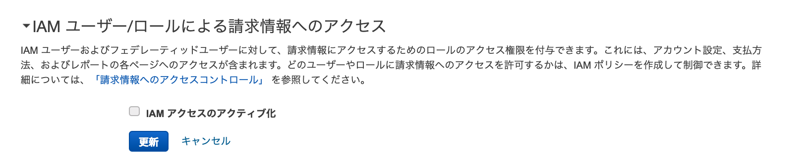

# 2019-03-12 (火曜日)

## AWS:IAM:  請求情報表示権限

- [請求の情報およびツールへのアクセス許可 - AWS 請求情報とコスト管理](https://docs.aws.amazon.com/ja_jp/awsaccountbilling/latest/aboutv2/grantaccess.html)

## Electron: 現在時刻

- [Moment Timezone - Docs](https://momentjs.com/timezone/docs/)
- [timeZone is not defined in OS X High Sierra · Issue #11670 · electron/electron](https://github.com/electron/electron/issues/11670)

~~~js
> var moment = require('moment-timezone')
> moment.tz().add('minutes', moment.tz().toDate().getTimezoneOffset() * -1).toDate()
2019-03-12T15:52:22.191Z
~~~

## Eelecton : sqlite3 orz

~~~
  Error: The module '/Users/hide/Documents/Boxes/ubn1804/projects/client/node_modules/sqlite3/lib/binding/electron-v4.0-darwin-x64/node_sqlite3.node'
  was compiled against a different Node.js version using
  NODE_MODULE_VERSION 64. This version of Node.js requires
  NODE_MODULE_VERSION 69. Please try re-compiling or re-installing
  the module (for instance, using `npm rebuild` or `npm install`).
~~~

~~~bash
$ pyenv versions
  system
  2.7.10
  anaconda3-4.3.1
* anaconda3-5.2.0 (set by PYENV_VERSION environment variable)
  django
~~~

~~~bash
$ export PYENV_VERSION=
Peeko-2:airwater-client hide$ pyenv versions
  system
* 2.7.10 (set by /Users/hide/.anyenv/envs/pyenv/version)
  anaconda3-4.3.1
  anaconda3-5.2.0
  django
~~~

## sequelize

- [Querying](http://docs.sequelizejs.com/manual/tutorial/querying.html#operators)
