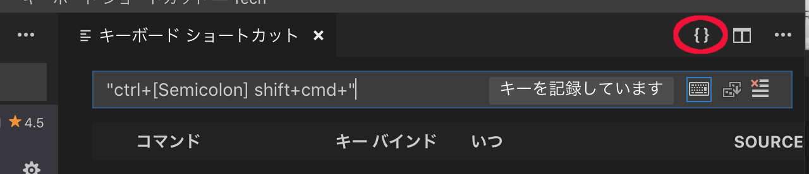
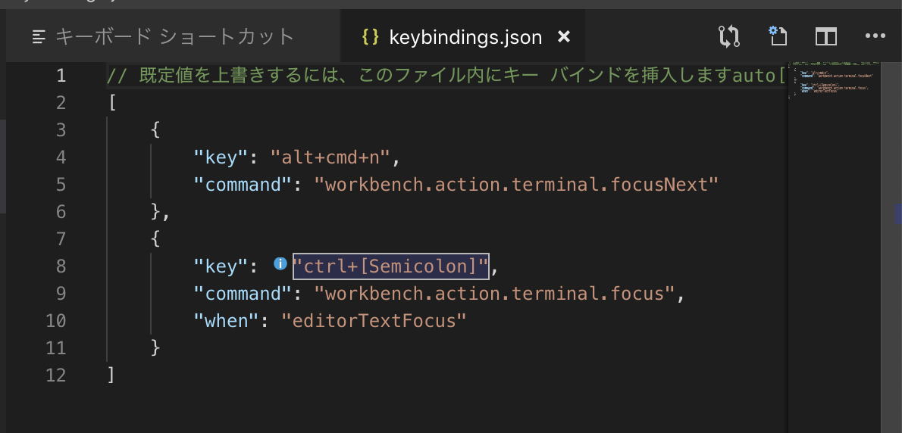

# 2019-03-17 (日曜日)

## 夜

- [川越街道平尾追分](http://home.e02.itscom.net/tabi/kawagoe/0hirao.html)

<iframe height='405' width='590' frameborder='0' allowtransparency='true' scrolling='no' src='https://www.strava.com/activities/2219792893/embed/170f46a6d8132e4e7f3ec7d052c6d0d21317b5ff'></iframe>

## Tierra Whack / "Whack World"

<iframe allow="autoplay *; encrypted-media *;" frameborder="0" height="150" style="width:100%;max-width:660px;overflow:hidden;background:transparent;" sandbox="allow-forms allow-popups allow-same-origin allow-scripts allow-storage-access-by-user-activation allow-top-navigation-by-user-activation" src="https://embed.music.apple.com/jp/album/cable-guy/1388073103?i=1388074097"></iframe>

## Malcolm McLaren / "Would Ya Like More Scratchin'"

<iframe allow="autoplay *; encrypted-media *;" frameborder="0" height="150" style="width:100%;max-width:660px;overflow:hidden;background:transparent;" sandbox="allow-forms allow-popups allow-same-origin allow-scripts allow-storage-access-by-user-activation allow-top-navigation-by-user-activation" src="https://embed.music.apple.com/jp/album/hobo-scratch/1453921784?i=1453922226"></iframe>

## Django: ModelAdmin.list_filter

- [django - How to override the queryset giving the filters in list_filter? - Stack Overflow](https://stackoverflow.com/questions/12522661/how-to-override-the-queryset-giving-the-filters-in-list-filter)

### サブクラスが定義されているモデル: ContentType フィールド を自分のサブクラスに絞る

models.py:

~~~py
class Package(models.Model):
    subclass_type = models.ForeignKey(
        ContentType, verbose_name=_("サブクラスタイプ"),
        null=True, blank=True, default=None,
        on_delete=models.SET_NULL)
    ...

    def save(self, *args, **kwargs):
        '''派生クラスの場合、自分のContentTypeを記録する'''
        if self._meta.parents:
            self.subclass_type = ContentType.objects.get_for_model(self)
        super().save(*args, **kwargs)

    @cached_property
    def instance(self):
        '''コンクリートインスタンスを返す'''
        return self.subclass_type and \
            self.subclass_type.get_object_for_this_type(id=self.id) or self

    @cached_property
    def model(self):
        '''コンクリートモデルクラス'''
        return self.subclass_type and self.subclass_type.model
~~~

admin_filters.py:

~~~py
from django.contrib import admin
from django.db.models.fields.related import OneToOneRel
from django.utils.functional import cached_property

def derived_models(cls):
    '''サブクラス一覧'''
    for i in cls._meta.related_objects:
        if all([
            isinstance(i, OneToOneRel),
            issubclass(i.related_model, cls._meta.model)
        ]):
            yield (i, i.related_model)

def only_subclasses(model_class):
    '''limit_choices_to'''
    _models = [m[1] for m in derived_models(model_class)]
    _limit_choices_to = {
        'app_label__in': list(set([m._meta.app_label for m in _models])),
        'model__in': list(set([m._meta.model_name for m in _models]))}
    return _limit_choices_to

class SubclassTypeFilter(admin.RelatedFieldListFilter):

    @cached_property
    def limit_choices_to(self):
        return only_subclasses(self.supermodel)

    def field_choices(self, field, request, model_admin):
        return field.get_choices(
            include_blank=False, 
            limit_choices_to=self.limit_choices_to)

    @classmethod
    def create(cls, supermodel):
        return type(
            f'SubclassTypeFilter{supermodel._meta.model_name}',
            (cls, ), {'supermodel': supermodel})
~~~

admin.py:

~~~py
@admin.register(models.Package)
class PackageAdmin(nested_admin.NestedModelAdmin):
    ...
    list_filter = [('subclass_type',
                    filters.SubclassTypeFilter.create(models.Package))]
    ...
~~~

## GIMP

- [GIMP で円を描く方法：塗りつぶし円と円の輪郭線](https://synclogue-navi.com/gimp-circle)
- [GIMPで綺麗な矢印がひきたい - こんぷれ](https://konpure.com/2017/11/11/post-3602/)
- [矢印（Draw arrow）](http://www.geocities.jp/gimproject1/scripts/draw-arrow/)

~~~bash
$ cd ~/Library/Application\ Support/GIMP/2.8/scripts/
$ mv ~/Downloads/draw-arrow.scm .
.
~~~

## VSCode

`⌘K⌘E` で `when` を入力するが、反映されない。

~~~json
[
    {
        "key": "ctrl+;",
        "command": "workbench.action.terminal.focus",
        "when": "editorTextFocus"
    },
    {
        "key": "ctrl+;",
        "command": "workbench.action.focusFirstEditorGroup",
        "when": "terminalFocus"
    }
]
~~~

### `{}` ボタンで `keybindings.json` を直接編集

- `File > Preferences > Keyboard Shortcuts`. (`Code > Preferences > Keyboard Shortcuts on macOS`)
- [Visual Studio Code Key Bindings](https://code.visualstudio.com/docs/getstarted/keybindings)
- [macOSキーマップ](https://go.microsoft.com/fwlink/?linkid=832143)

