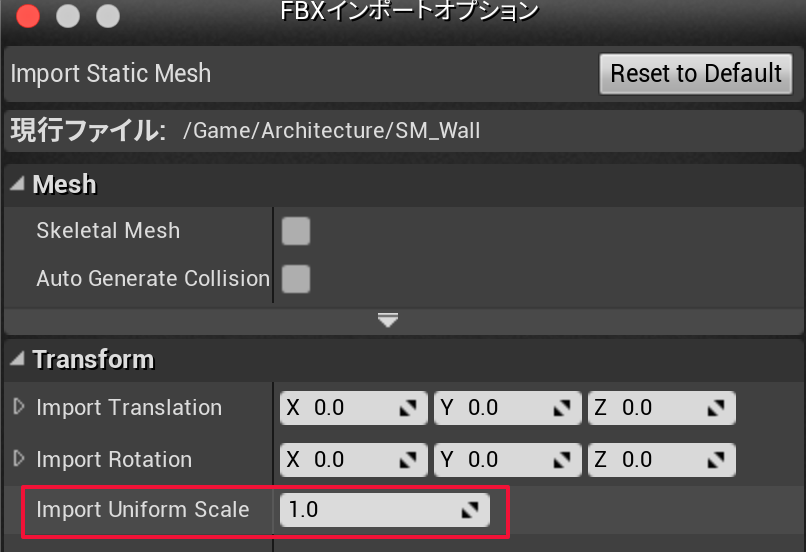

# 2019-06-13 (木曜日)

## Wordpress: パスワード付きダウンロード

- [Create a Password Protected Download in WordPress](https://www.tipsandtricks-hq.com/create-a-password-protected-download-file-6838?fbclid=IwAR02SI6QPw5esTVO3XaEoveLjoZkX0BYRPQ5Watdvx-U6d8cVMr-Joz_01o)
- [Simple Download Monitor – WordPress plugin - WordPress.org](https://wordpress.org/plugins/simple-download-monitor/)
- [Simple Download Monitor ファイルダウンロードのプラグイン – WordPressの使い方](http://wordpress.nnn2.com/?p=677)

## Wordpress: StaticPress

- [StaticPress](http://ja.staticpress.net/)

## AWS S3

- [S3 の事前署名付き（期限付き）URL を生成する - cloudpack.media](https://cloudpack.media/4052)
- [AWS SDK for PHP バージョン 3 での Amazon S3 の署名付き URL - AWS SDK for PHP](https://docs.aws.amazon.com/ja_jp/sdk-for-php/v3/developer-guide/s3-presigned-url.html)

~~~php
require 'vendor/autoload.php';

use Aws\S3\S3Client;  
use Aws\Exception\AwsException;
~~~

~~~php
$s3Client = new Aws\S3\S3Client([
    'profile' => 'default',
    'region' => 'us-east-2',
    'version' => '2006-03-01',
]);

$cmd = $s3Client->getCommand('GetObject', [
    'Bucket' => 'my-bucket',
    'Key' => 'testKey'
]);

$request = $s3Client->createPresignedRequest($cmd, '+20 minutes');
~~~

- [S3 Secure URL – WordPress plugin - WordPress.org](https://wordpress.org/plugins/s3-secure-url/)

## UE4 メッシュ

- `1ユニット` == `1センチ(cm)`

変換:

- 元アセット `1ユニット` == `10cm` の場合 変換してインポート

## EMOTET

- [流行マルウェア「EMOTET」の内部構造を紐解く - MBSD Blog](https://www.mbsd.jp/blog/20181225_2.html)

## Axios/async await

- [javascript - Making 2 sequential requests with Axios - second request depends on the response of 1st - Stack Overflow](https://stackoverflow.com/questions/47343225/making-2-sequential-requests-with-axios-second-request-depends-on-the-response)
- [Understanding async-await in Javascript – Hacker Noon](https://hackernoon.com/understanding-async-await-in-javascript-1d81bb079b2c)
- [async/await 入門（JavaScript） - Qiita](https://qiita.com/soarflat/items/1a9613e023200bbebcb3)
- [async function - JavaScript - MDN](https://developer.mozilla.org/ja/docs/Web/JavaScript/Reference/Statements/async_function)

~~~js
async function getData() {
      const firstRequest = await axios.get(`${<URL1>}`);
      data1 = firstRequest.data[0];
      if (!data1){
          const secondRequest = await axios.get(`${<URL2>}`);
          data1 = secondRequest.data;
      }
      return data1;
  }

...

getData();
~~~
