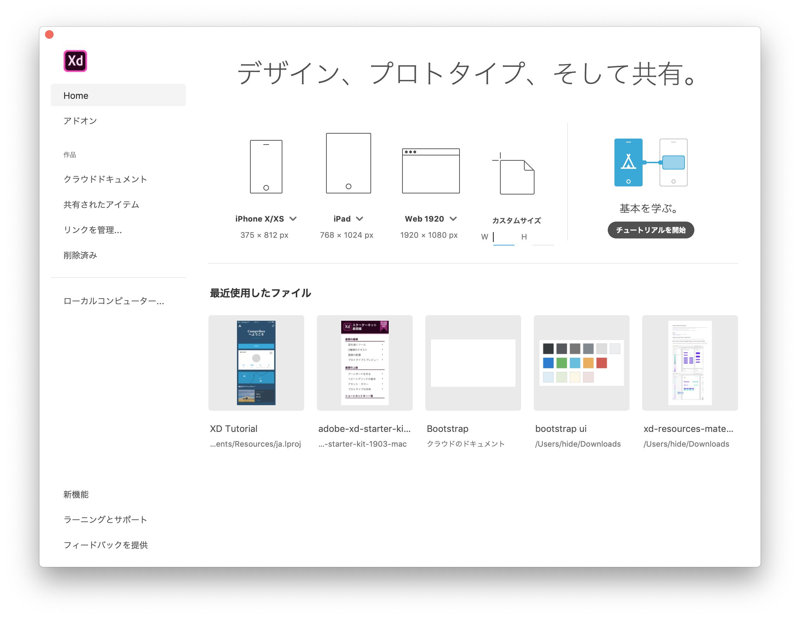

# 2019-05-04 (土曜日)

## Adobe XD

- [10分で分かる！Adobe XDの新機能や実践的な使い方が学べるAdobe公式チュートリアルファイル中級編 - コリス](https://coliss.com/articles/build-websites/operation/design/adobe-xd-starter-kit-intermediate.html)
- [Adobe XD体験版ダウンロード - UI/UXデザイン、プロトタイプ、共同作業ツール](https://www.adobe.com/jp/products/xd.html)

### チュートリアル

<iframe width="560" height="315" src="https://www.youtube.com/embed/Kj3cfHFgczs" frameborder="0" allow="accelerometer; autoplay; encrypted-media; gyroscope; picture-in-picture" allowfullscreen></iframe>

## シェイプ

- [Adobe XDのシェイプを徹底攻略 – Risa Yuguchi – Medium](https://medium.com/@risayuguchi/adobe-xd%E3%81%AE%E3%82%B7%E3%82%A7%E3%82%A4%E3%83%97%E3%82%92%E5%BE%B9%E5%BA%95%E6%94%BB%E7%95%A5-88918f46ec10)
- [AdobeXDで正三角形（正多角形）を作る - Qiita](https://qiita.com/gureta/items/29e26835c5705352e3a9)

## シンセ

<iframe width="560" height="315" src="https://www.youtube.com/embed/u83oYjNqJJ4" frameborder="0" allow="accelerometer; autoplay; encrypted-media; gyroscope; picture-in-picture" allowfullscreen></iframe>

リンドラムと言えばプリンス。だが、Dead Or Alive のパターンは強烈:

<iframe width="560" height="315" src="https://www.youtube.com/embed/ofKyPTXt5co" frameborder="0" allow="accelerometer; autoplay; encrypted-media; gyroscope; picture-in-picture" allowfullscreen></iframe>

[Stock Aitken Waterman - A Simple Stock Aitken Waterman Italian Fan Site (& Kylie Minogue): Linn Drum Pop & Disco Beats](https://stock-aitken-waterman.blogspot.com/2009/05/linn-drum-pop-disco-beats.html)
:
<iframe width="560" height="315" src="https://www.youtube.com/embed/jrEIP8EiFUQ" frameborder="0" allow="accelerometer; autoplay; encrypted-media; gyroscope; picture-in-picture" allowfullscreen></iframe>

## YMO, 1979 at THE GREEK THEATERE

<iframe width="560" height="315" src="https://www.youtube.com/embed/QUn6V49PG00" frameborder="0" allow="accelerometer; autoplay; encrypted-media; gyroscope; picture-in-picture" allowfullscreen></iframe>

<iframe width="560" height="315" src="https://www.youtube.com/embed/6Z5sJJgX3GM" frameborder="0" allow="accelerometer; autoplay; encrypted-media; gyroscope; picture-in-picture" allowfullscreen></iframe>

<iframe width="560" height="315" src="https://www.youtube.com/embed/YastQM59JQE" frameborder="0" allow="accelerometer; autoplay; encrypted-media; gyroscope; picture-in-picture" allowfullscreen></iframe>

<iframe width="560" height="315" src="https://www.youtube.com/embed/hzSIwivBWJc" frameborder="0" allow="accelerometer; autoplay; encrypted-media; gyroscope; picture-in-picture" allowfullscreen></iframe>

<iframe width="560" height="315" src="https://www.youtube.com/embed/9OQ-b2l-NCk" frameborder="0" allow="accelerometer; autoplay; encrypted-media; gyroscope; picture-in-picture" allowfullscreen></iframe>

<iframe width="560" height="315" src="https://www.youtube.com/embed/0HubIA-BGGI" frameborder="0" allow="accelerometer; autoplay; encrypted-media; gyroscope; picture-in-picture" allowfullscreen></iframe>

## Prince, Funk

<iframe width="560" height="315" src="https://www.youtube.com/embed/fmOdoSQegpk?start=209" frameborder="0" allow="accelerometer; autoplay; encrypted-media; gyroscope; picture-in-picture" allowfullscreen></iframe>

<iframe width="560" height="315" src="https://www.youtube.com/embed/Pq98n2j75XA" frameborder="0" allow="accelerometer; autoplay; encrypted-media; gyroscope; picture-in-picture" allowfullscreen></iframe>

<iframe width="560" height="315" src="https://www.youtube.com/embed/9Lgf2VU_M70" frameborder="0" allow="accelerometer; autoplay; encrypted-media; gyroscope; picture-in-picture" allowfullscreen></iframe>

<iframe width="560" height="315" src="https://www.youtube.com/embed/tu4kASbdS9o" frameborder="0" allow="accelerometer; autoplay; encrypted-media; gyroscope; picture-in-picture" allowfullscreen></iframe>

<iframe width="560" height="315" src="https://www.youtube.com/embed/tu4kASbdS9o" frameborder="0" allow="accelerometer; autoplay; encrypted-media; gyroscope; picture-in-picture" allowfullscreen></iframe>

## Prince Tribute and More

<iframe width="560" height="315" src="https://www.youtube.com/embed/_l4Dh4NGdPs" frameborder="0" allow="accelerometer; autoplay; encrypted-media; gyroscope; picture-in-picture" allowfullscreen></iframe>

<iframe width="560" height="315" src="https://www.youtube.com/embed/fuGtnG8lM6o" frameborder="0" allow="accelerometer; autoplay; encrypted-media; gyroscope; picture-in-picture" allowfullscreen></iframe>

<iframe width="560" height="315" src="https://www.youtube.com/embed/e5-HEBGPzFM" frameborder="0" allow="accelerometer; autoplay; encrypted-media; gyroscope; picture-in-picture" allowfullscreen></iframe>

## Something is the Water, VA Beach

<iframe width="560" height="315" src="https://www.youtube.com/embed/HhvOV-xawNc" frameborder="0" allow="accelerometer; autoplay; encrypted-media; gyroscope; picture-in-picture" allowfullscreen></iframe>

## Music

Travis Scott "ASTROWORLD" にも参加の オーストラリア・パース出身の5人組サイケデリック・ロックバンド:

<iframe allow="autoplay *; encrypted-media *;" frameborder="0" height="150" style="width:100%;max-width:660px;overflow:hidden;background:transparent;" sandbox="allow-forms allow-popups allow-same-origin allow-scripts allow-storage-access-by-user-activation allow-top-navigation-by-user-activation" src="https://embed.music.apple.com/jp/album/borderline/1459193328?i=1459193335"></iframe>

- [Tame ImpalaのKevin ParkerがKanye Westとの曲作りを「混乱」と語る - FNMNL (フェノメナル)](https://fnmnl.tv/2018/07/25/56712)
- [Travis Scottとの曲作りをKevin Parkerが語る｜マリファナの煙が充満し人生最大の音量で音楽が流れる - FNMNL (フェノメナル)](https://fnmnl.tv/2018/08/24/58356)

88Rising:

<iframe allow="autoplay *; encrypted-media *;" frameborder="0" height="150" style="width:100%;max-width:660px;overflow:hidden;background:transparent;" sandbox="allow-forms allow-popups allow-same-origin allow-scripts allow-storage-access-by-user-activation allow-top-navigation-by-user-activation" src="https://embed.music.apple.com/jp/album/blood-on-my-hands-feat-smino/1451768211?i=1451768212"></iframe>

ソウルフルなグライム:

<iframe allow="autoplay *; encrypted-media *;" frameborder="0" height="150" style="width:100%;max-width:660px;overflow:hidden;background:transparent;" sandbox="allow-forms allow-popups allow-same-origin allow-scripts allow-storage-access-by-user-activation allow-top-navigation-by-user-activation" src="https://embed.music.apple.com/jp/album/fire-in-the-booth-pt-1/1461228896?i=1461228914"></iframe>

Buddy at COACHELLA Soulection set:

<iframe width="560" height="315" src="https://www.youtube.com/embed/bPhQXvd-1i0" frameborder="0" allow="accelerometer; autoplay; encrypted-media; gyroscope; picture-in-picture" allowfullscreen></iframe>

## Whisky

[シングルモルト、バーボン、ライなど…ウイスキー9種の違いを比較解説](https://liquorpage.com/compare-9-kinds-of-whiskey/)

| 種類             | 原料              |   蒸留       |      |
| ----------------| ---------------- | -------------| -----|
| モルトウイスキー   | 大麦麦芽のみ       | 単式蒸留       | |
| グレーンウイスキー | トウモロコシなど雑穀	| 連続式蒸留	 |  |
| シングルモルト     | | | 単一の蒸留所で造られたモルトウイスキー |
| ブレンデッドモルト |   |  | 複数の蒸留所のモルトウイスキーをブレンド、別名ヴァッテッドモルト|
| ブレンデッドウイスキー | | | モルトウイスキーとグレーンウイスキーをブレンド                           |
| バーボンウイスキー    | トウモロコシ        | 連続式蒸留	| アメリカのみ                       |
| テネシーウイスキー    | トウモロコシ        | 連続式蒸留 | アメリカ・テネシー州のみ               |
| ライウイスキー       | ライ麦              | 連続式蒸留 | アメリカのみ(カナダ産は別物)           |
| シングルポットスチル  | 大麦麦芽、大麦        | 単式蒸留  | アイルランドのみ、別名ピュアポットスチル |

[単式蒸留と連続式蒸留の違いとは？を初心者向けに簡単解説！](https://liquorpage.com/difference-potstill-patentstill/)

### 単式蒸留

- 一回ずつしか蒸留ができないアナログ方式 
- モルトウイスキー, テキーラ, コニャック, 芋、麦、米などの本格焼酎, 泡盛, ジン(連続式併用) ,ラム
- 原料の風味が残りやすく、手間がかかるため出来上がるお酒はやや高価

### 連続式蒸留

- 連続的に蒸留ができるハイテク方式 (中に単式蒸留器がいくつも入っている) 
- バーボン(単式もあり), グレーン・ウイスキー, アルマニャック, ウォッカ(単式もあり), ラム, 甲類焼酎, ニュートラル・スピリッツ
- 効率的により度数が高いお酒を作れる
- 原料の風味が残りづらくクリアなわいになる傾向

## Scotch Whisky

[スコッチウイスキー入門・6つの産地別特徴まとめ](https://liquorpage.com/scotch-whiskey-production-area-summary/):

- スペイサイド [Speyside](https://liquorpage.com/explanation-of-speyside-singlemalt/): 代表的な産地、フルーティーで華やかな香り・風味 (マッカラン,グレンフィディック,グレンリベット)
- ハイランド [Highland](https://liquorpage.com/explanation-of-highland-singlemalt/): 北側の広大な産地、各地域、銘柄によって特徴が異なる (グレンモーレンジィ
, オールド・プルトニー...)
- キャンベルタウン [Campbeltown](https://liquorpage.com/explanation-of-campbeltown-singlemalt/): かつての主要産地、塩っ気を感じる独特の風味 (スプリングバンク, ロングロウ, グレンスコシア)
- ローランド [Lowland](https://liquorpage.com/explanation-of-lowland-singlemalt/) : 南側の大都市を要する産地、ややライトな酒質 (オーヘントッシャン
,グレンキンチー...)
- アイランズ [Islands](https://liquorpage.com/explanation-of-island-singlemalt/): スコットランド周辺の島々、銘柄ごとの個性が強い (タリスカー,ハイランドパーク, スキャパ..)
- アイラ [Islay](https://liquorpage.com/explanation-of-islay-singlemalt/): たった一つの島ながらも有名銘柄が揃う、スモーキーで超個性的な香り・風味 (ラフロイグ、ボウモア、アードベッグ..)

## Vitamix

- [にんじんとたまねぎのドレッシング](http://www.vita-mix.jp/recipe/all/2015/06/04/123)
- [やみつきドレッシング - Vitamix - アントレックス公式ブログ](http://www.entrex-blog.jp/brand/vitamix/shop/vitamix-/system-system-1515977836776-apparelcloud.blog-988d85f2-b1f2-45de-92c1-89b7e272ab68)
