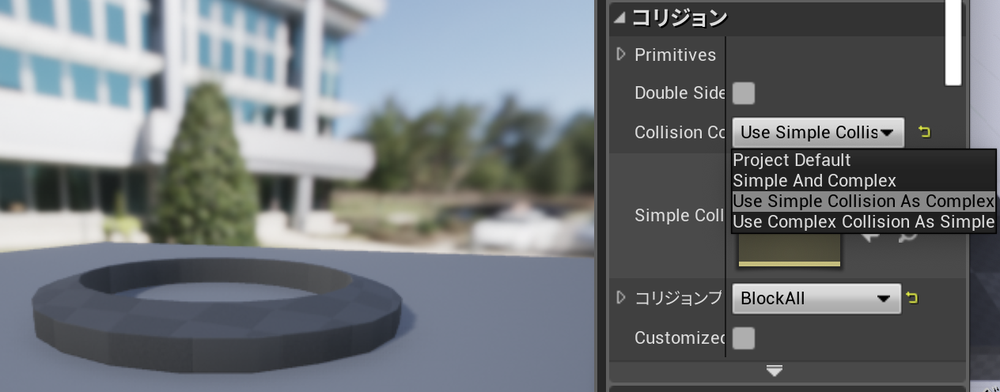

# 2019-06-21 (金曜日)

## Run: 五本木

<iframe height='405' width='590' frameborder='0' allowtransparency='true' scrolling='no' src='https://www.strava.com/activities/2468351253/embed/d314c6b2f01d838e6e4be8b163c10c1b2a578f11'></iframe>

## Perforce / Helix Core

- [Helixバージョン管理ソフトウェア - Perforce](https://www.perforce.com/ja/zhipin/helix-core)
- [Perforce - アプリケーション開発者向けソリューション](https://www.perforce.com/ja)
- [Git、Mercurial、Subversion、Perforce、どれを使う？ - Qiita](https://qiita.com/tarosuke@github/items/1eab3cff3273a488a499)
- [自前でPerforceサーバー立てたいけど: 新 masafumi's Diary](http://masafumi.cocolog-nifty.com/masafumis_diary/2016/09/perforce-e3b7.html)
- [Linuxパッケージを利用してPerforceサーバをインストールすることができますか？ - 東陽テクニカ](https://www.toyo.co.jp/ss/faq/detail/id=12767)
- [Download Software - Perforce](https://www.perforce.com/downloads)

Helix Core:

- [Helix Core Server Administrator Guide: Fundamentals](https://www.perforce.com/manuals/p4sag/Content/P4SAG/Home-p4sag.html#)
- [Installing the server > Linux package-based installation > Installation](https://www.perforce.com/manuals/p4sag/Content/P4SAG/install.linux.packages.install.html)

P4クライアント:

- [Helix Visual Client（P4V） - Perforce](https://www.perforce.com/ja/zhipin/helix-core-apps/helix-visual-client-p4v)
- [Helix Command-Line Client（P4） - Perforce](https://www.perforce.com/ja/zhipin/helix-core-apps/command-line-client)
- [UE4でPerforceと連携するための手順](https://www.slideshare.net/EpicGamesJapan/ue4perforce-51845918)
- [ソース コントロールとして Perforce を使用する - Unreal Engine](https://api.unrealengine.com/JPN/Engine/Basics/SourceControl/Perforce/index.html)

Git:

- [Git vs. Perforce: Key Differences + How to Choose](https://www.perforce.com/blog/vcs/git-vs-perforce-how-choose-and-when-use-both)
- [Helix4Git管理者ガイド (2017.2) - 本ガイドの使用方法](https://www.toyo.co.jp/files/user/img/product/ss/help/perforce/r17.2/manuals/helix4git/index.html)

## axios: PHP クエリパラメータ

- [Providing an array as a param isn't working as expected. · Issue #604 · axios/axios](https://github.com/axios/axios/issues/604)
- [【Vue.js】Vue.jsでAjax通信(php)【axios,php】 - The sky is the limit](http://www.sky-limit-future.com/entry/axios_and_php)
- [javascript - Multiple fields with same key in query params (axios request)? - Stack Overflow](https://stackoverflow.com/questions/42898009/multiple-fields-with-same-key-in-query-params-axios-request/43208627)
- [How to send get request with multiple same param? · Issue #709 · axios/axios](https://github.com/axios/axios/issues/709)

## UE4: コリジョン

プリミティブ(単純化):

- 球体
- カプセル
- ボックス

[K-DOP(K discrete oriented polytope)](https://docs.unrealengine.com/ja/Engine/Physics/Collision/HowTo/AddDOP/index.html):

- 10DOP-X
- 10DOP-Y
- 10DOP-Z

[メッシュ形状コリジョン](http://unrealengine.hatenablog.com/entry/2016/05/05/213000)

- DCCツール（MayaやBlenderなど）でメッシュオブジェクトに名前をつけてコリジョンとして利用
- オートコンベックスコリジョン
- `Collision Complexity`

## DCC

- [DCCツールを使いたくなってきたでしょ？ - Qiita](https://qiita.com/housakusleeping/items/d5d8c5a169d5bdedfe10)

### Substance Designer

- [Substance Designer [Allegorithmic] - ボーンデジタル](https://www.borndigital.co.jp/software/1000.html)

### Blender

- [Blender.jp](https://blender.jp/)
- [blender.org - Home of the Blender project - Free and Open 3D Creation Software](https://www.blender.org/)

### Cinema 4D

- [Welcome - MAXON - 3D FOR THE REAL WORLD](https://www.maxon.net/jp/)
