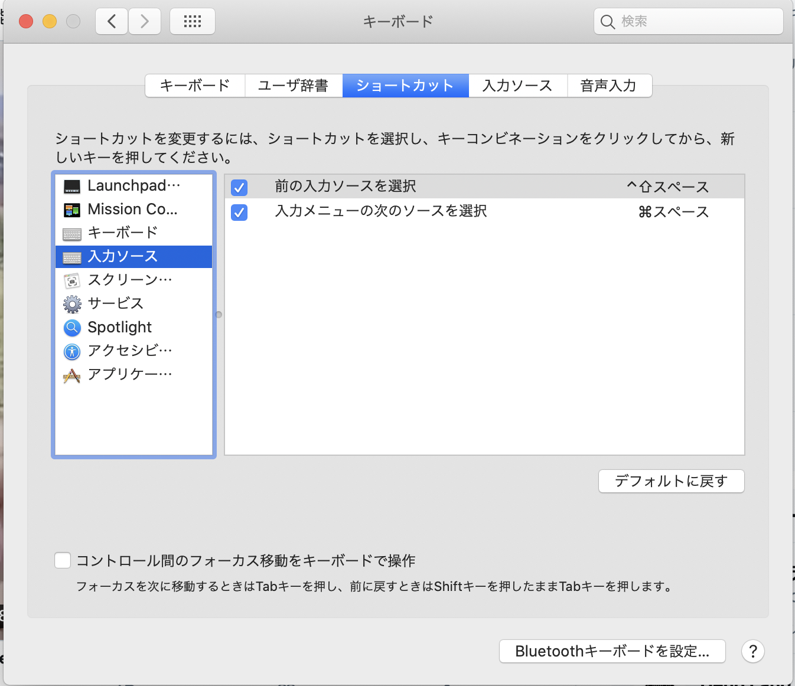
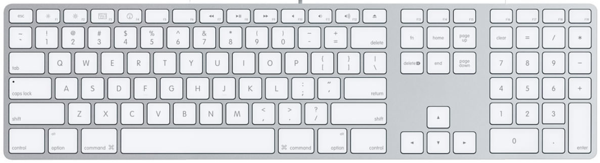

# 2020-06-06 (土)

## macOS: US　キーボード

[MacbookのUSキーボードで入力切替（かな⇔英字）をする方法。](https://hl-journal.com/mac/mac-uskey-change/)

## Bootstrap: リスト

- [Day 12: Bootstrap 4 Lists Tutorial and Examples](https://bootstrapbay.com/blog/day-12-bootstrap-4-lists-tutorial-and-examples/)

## Vue.js : 日時ピッカー(datetime picker)

- https://ankurk91.github.io/vue-flatpickr-component/ これでいい
- [ローカライズ](https://flatpickr.js.org/localization/)

その他:

- [chronotruck/vue-ctk-date-time-picker](https://github.com/chronotruck/vue-ctk-date-time-picker)
- https://chronotruck.github.io/vue-ctk-date-time-picker/
- [UMD](https://github.com/umdjs/umd)

~~~html
<link
  rel="stylesheet"
  type="text/css"
  href="${YOUR_PATH}/vue-ctk-date-time-picker.css"
/>

  <VueCtkDateTimePicker v-model="yourValue"></VueCtkDateTimePicker>

<script type="text/javascript">
  Vue.component('vue-ctk-date-time-picker', window['vue-ctk-date-time-picker']);
  new Vue({
    el: '#app',
    data() {
      return {
        yourValue: null
      };
    }
  });
~~~