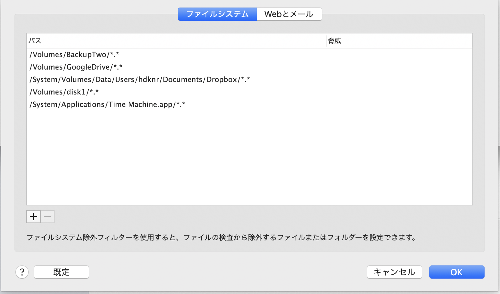

# 2020-06-11 (木曜日)

## macOS: Timemachineが失敗する

- [[KB3263] Exclude Apple Time Machine backups from scanning in ESET Cyber Security or ESET Cyber Security Pro](https://support.eset.com/en/kb3263-exclude-apple-time-machine-backups-from-scanning-in-eset-cyber-security-or-eset-cyber-security-pro)

`ESET` > `詳細設定` > 

## macOS: /etc/hosts 管理

- [Mac用にDnsmasqでローカル開発用のドメイン(*.test)を設定する](https://nextat.co.jp/staff/archives/248)
- [Gas Mask](https://github.com/2ndalpha/gasmask)