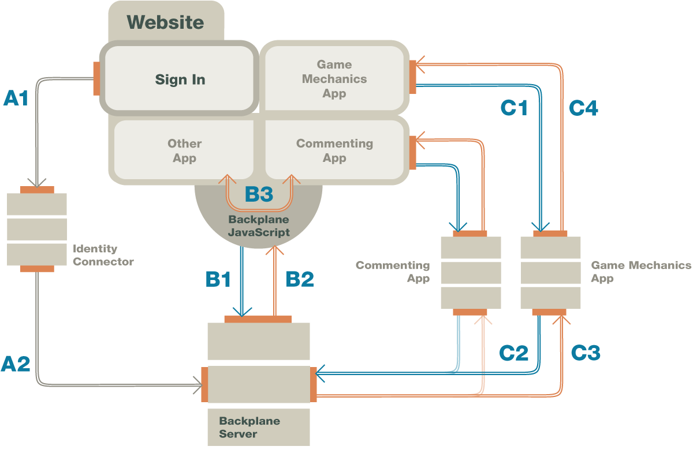

==========
Backplane 
==========

http://developers.janrain.com/documentation/backplane-protocol/

.. contents:: Backplane

Protocol
================

Overview
----------------

The Backplane Protocol is an open source protocol, 
developed to simplify communications between multiple web widgets 
and applications on the same web page. 

Instead of each widget or application using their own scheme to access user data, 
Backplane-enabled widgets listen to a single, 
common Backplane Server for updates.

The Backplane Protocol can publish different types of messages, 
alerting widgets when users have authenticated, 
or activities the user is sharing with social network.

Publishing Authentication Data on Backplane
------------------------------------------------

1. User is authenticated with a Backplane-enabled sign-in widget, such as Janrain Engage.
2. The widget publishes a message on a Backplane Server channel.
3. Widgets on the web page listening to the Backplane are updated.

Audiences
---------------

Two audiences:

-    Website Owners — Add Backplane functionality to a website.
-    Product Developers — Add Backplane support to a product, such as a widget.

Version
----------

The Backplane Protocol is an open source, 
cross-company initiative aimed at advancing web app technology. 
There are currently two versions:

-   Backplane Protocol 1.2 – The first public implementation of Backplane Protocol. 
    Supports publishing Identity messages.

-   Backplane Protocol 2.0 – Uses :term:`OAuth2` for the **authorization process**. 
    Supports an `Identity Scenario`_ , 
    and will support an `Activity Streams Scenario`_ when implemented. 
    `Messages`_ also have been re-engineered to send only **header** information 
    to browser or anonymous clients,  
    the **payload** is sent to authenticated clients as specified in the protocol.

Protocol Flow
====================

Backplane Protocol
------------------------

Figure 1 shows an example of the Backplane Protocol identity message flow using Janrain as the authenticating service.

    
    Figure 1

[A] Message Posting with the Backplane Protocol
------------------------------------------------------------

    A1) :term:`User` signs in to website.

    A2) :term:`Identity connector` publishes Identity/Login events to the Backplane Server.

[B] Message Notification
------------------------------------------------------------

    B1) A Backplane-compliant application polls the :term:`Backplane Server` for `messages`_ .

    B2) The :term:`Backplane Server` delivers the message to the clients running in the browser, absent the payload.

    B3) The :term:`Backplane JavaScript` distributes the message to apps that are registered for the message.

[C] Message Retrieval
------------------------------------------------------------

    C1) :term:`Widgets` make :term:`JSONP` calls to their servers.

    C2) :term:`Widget Server` calls :term:`Backplane Server` for full message and payload.

    C3) :term:`Widget Server` securely receives payload.

    C4) :term:`Widget Server` returns subset of payload to application on website.

Messages
============

Senarios
-----------

The :term:`Backplane Server` can retrieve different types of messages 
and send them on to the :term:`widgets`. 

In `Backplane Protocol`_ terms, 
a :term:`Scenario` is an a protocol extension 
that defines one or more message types and specifies their semantics, use, and so on. 
Currently, the Scenarios in development on the Backplane Protocol are:

Identity Scenario
^^^^^^^^^^^^^^^^^^^^^^^^^^^^^^^^^^^

Updates all widgets with user data 
once a :term:`login widget` publishes to a :term:`Backplane channel`.

Activity Streams Scenario
^^^^^^^^^^^^^^^^^^^^^^^^^^^^^^^^^^^

Coming soon: 
When a user shares activities on a social network, 
widgets will be informed as well.

Messages in Backplane Protocol v1.2 versus messages in Backplane Protocol 2.0
------------------------------------------------------------------------------------------

One of the improvements in the newer version is that 
Backplane 1.2 always delivers the entire data payload, 
while Backplane 2.0 delivers only the header information to browser 
or anonymous clients, 
and sends the full the data payload to authenticated clients according to the protocol. 
While on the surface 
this may appear to be a step backwards in the evolution of the Backplane protocol, 
it was done for two important reasons.

The first is the security principle of “ **least privilege**,” 
which states that applications should only have access to data 
that directly concerns them, 
rather than a firehose of sensitive data 
that may or not be directly consumed by the subscriber of the content.

Secondly, 
it was desirable to conserve :term:`bandwidth`. 
As payloads become more data rich, 
they may contain several **hundred kilobytes** of data each. 
Pumping the entire payload to the JavaScript client library would be wasteful.

Because the client implementing the Backplane 2.0 JavaScript library 
receives only the **message header**, 
each application subscribing to the message needs to use an API 
to contact their server-based applications, 
which then send the relevant information. 

Backplane 2.0 allows server-side applications (
as authenticated clients) to consume the entire message content, 
including the payload portion.

Add to Your Website
==============================

.. note::

    The `Backplane Protocol`_, 
    and Janrain’s implementation of the Backplane Server, are new. 
    We anticipate that given user feedback we will modify the documentation, 
    so check back frequently for updates.

This section explains how to integrate the `Backplane Protocol`_ into your website. 
When you are finished, 
your site will publish messages to a channel on a :term:`Backplane Server` 
using the Janrain :term:`Capture` or :term:`Engage` widget.

There is no need for any further configuration if your website is already using Backplane-compliant widgets and web apps. See our list of supported technologies for more information.

.. note::

    You must have access to a working :term:`Backplane Server`. 
    You can build your own with the `open source version <http://backplanex.com/server-operator/>`_ , 
    or Janrain can provide access to one. 

    Technologies used:

        - HTML markup and DOM
        - Javascript XMLHTTP and asynchronous events
        - JSON/JSONP

The main steps to integrating Backplane Protocol on a website are:

    1. `Obtain bus name and credentials from Capture Dashboard`_ .
    2. `Add backplane.js`_ .
    3. `Initialize the Backplane object`_ .
    4. `Configure Backplane channel for Engage or Capture`_ .

We recommend that you implement the latest 2.0 version of the Backplane Protocol. 
Directions for version 1.2 are provided for organizations that have already installed version 1.2.

.. seqdiag:: backplane/website.diag

Obtain Bus Name and Credentials from Capture Dashboard
------------------------------------------------------------------

In the Capture Dashboard, this value is listed as backplane_bus. Copy this value to a text file, or write it down. You will need this later.  For Engage credentials, please contact your Janrain support representative.

The Bus Owner credential is used by the website operator or Bus Owner to authenticate with the Backplane Server before authorizing OAuth clients (widgets) to post to their bus.

The OAuth token is used by widgets to post messages on a bus. (Widgets that do not use OAuth2 can still use the Backplane 1.2 authorization procedure.)

Add backplane.js
-------------------------------------------------------

Place this code in the <head> section of the webpage hosting the widgets. This script adds the library to your web page that the Backplane Server uses. Any Backplane-enabled widgets on this web page, regardless of who made them, will have access to the Backplane bus.

.. code-block:: html

    

Initialize the Backplane Object
-------------------------------------------------------

Add the code below to the <body> section of the web page, replacing the busName value with the one obtained at Step 1.

.. code-block:: html

    

This script requests a channel on the server and initializes the Backplane object and associated cookies. The process is asynchronous and does not affect web page load times.

Configure Backplane Channel for Engage or Capture
-------------------------------------------------------

In order for the Capture or Engage widget to publish messages, it retrieves a Backplane channel from the Backplane Server.

Because Backplane 2.0 is OAuth2 compliant, access to the Backplane Server should be through an OAuth2 access token. (You can still use the “manual” access of Backplane 1.2 if your widget is not OAuth2 compliant.) This access token is issued by the Backplane Server and is essentially a “valet key” that allows the user to access resources “owned” by a particular bus owner (in this case, your Janrain application).

To initialize the Engage widget, add the following code to the <body> of the web page:

.. code-block:: javascript

    function doBackplaneStuff() {
        janrain.engage.signin.setBackplaneChannel(Backplane.getChannelID());
        bpListen();
    }

To initialize the Capture widget, add the following code to the <body> of the web page:

.. code-block:: javascript

    function doBackplaneStuff() {
     document.getElementById('capture-signin').href +
     '&bp_channel='+encodeURIComponent(Backplane.getChannelID());
     bpListen();
    }

When a visitor authenticates with a Backplane-enabled service like Capture or Engage, 
that service will publish an event to the specified Backplane channel.

Supported Widges
--------------------

Once you’ve enabled the :term:`Backplane Server` for your website, 
the next step is to choose from the many `Backplane Protocol`_ ready widgets 
and web apps available to power your site.

Here is a list of companies that offer `Backplane Protocol`_ compliant apps:

- Echo  
     
    - http://aboutecho.com/products/social-login.html

- Janrain 

    - http://janrain.com/products/engage/
    - http://janrain.com/products/capture/

- Livefyre

    - http://www.livefyre.com/features/

- Badgeville

    - http://www.badgeville.com/Behavior-Management-Suite

- Bigdoor

    - http://www.bigdoor.com/features/

- Envolve

    - https://www.envolve.com/docs/

- Arktan

    - http://arktan.com/products

- Realtidbits

    - http://realtidbits.com/our-products/features

- Tokbox

    - http://www.tokbox.com/opentok/api/documentation/gettingstarted

- Stocial

    - http://stocial.com

- Jetjaw

    - http://www.jetjaw.com/m/features

Add to Your Application
================================

.. note::

    The `Backplane Protocol`_ , 
    and Janrain’s implementation of the :term:`Backplane Server` , are new. 
    We anticipate that given user feedback we will modify the documentation, 
    so check back frequently for updates.

These directions are for application developers 
adding Backplane functionality to a standalone application 
or a web application (as opposed to a website). 

Once implemented, 
your widget or web app will be configured to listen to a :term:`Backplane Server` , 
and will be able to be deployed in any Backplane-enabled site.

Integration Steps
---------------------

    1. Obtain authentication credentials for your specific bus.

    2. Set up the application to listen for Backplane messages.

    3. Implement a logout.

We recommend that you implement the latest 2.0 version of the Backplane Protocol. 
Directions for version 1.2 are provided for legacy purposes.

Flow
------------
The following steps describe the Backplane Protocol 2.0 Flow (see Figure 1), 
and how to integrate your application or web app with each step:

-   `1. Register for Callback`_
-   `2. Identity/Login Published on Backplane Server Channel`_
-   `3. Poll for Messages on Website`_
-   `4. Request Payload from Backplane Server`_
-   `5. Process Payload`_
-   `6. Widget Server Subset of Payload to Widget`_

.. seqdiag:: backplane/application.diag

Before Proceeding
^^^^^^^^^^^^^^^^^^^^^^^^^^

In the Capture Dashboard,
you need the values listed as backplane_password and backplane_bus. 
Copy these values to a text file, or write them down. You will need these later.

For Engage credentials, please contact your Janrain support representative.

1. Register for Callback
^^^^^^^^^^^^^^^^^^^^^^^^^^^^^^^^^^^^^^^^

One of the notable differences in Backplane Protocol v2.0 from Backplane Protocol v1.2 is that the message payload (that portion of the message containing personally identifiable content) is removed from the message arriving at the non-credentialled client. The Backplane 2.0 widget listens for a message, and then requests the data to go along with the message from another server. For more information on this change in procedure, refer to Messages.

The following is sample code used to listen to the Backplane channel for ‘identity/login’ messages. Once this message type is received, this code will make a call to its server-side component, using JSONP, to fetch the portion of the payload that is important for their function. See Step 4 for details.

.. code-block:: javascript

    function fetchPersonalData(messageId) {
    var oldScript;
    // Cleanup old script if it exists to prevent memory leak
    // This will also prevent more than one server side request from pending
    // at any point - which may or may not be desirable
    while (oldScript = document.getElementById('fetchSingleMessage')) {
    oldScript.parentNode.removeChild(oldScript);
    for (var prop in oldScript) {
    delete oldScript[prop];
    }
    }
    var script = document.createElement("script");
    script.type = "text/javascript";
    script.id = 'fetchSingleMessage';
    script.src = "getsinglemessage.php?"
    + "v=" + new Date().getTime() // to prevent browser caching
    + "&amp;callback=fetchCallback" // the user-defined callback
    + "&amp;messageid=" + encodeURIComponent(messageId);
     
    var firstScript = document.getElementsByTagName("script")[0];
    firstScript.parentNode.insertBefore(script, firstScript);
    }
    function bpListen() {
    window.escSubscription = Backplane.subscribe(function(backplaneMessage) {
     
    //
    //This enclosed function runs when any message is received.
    //Sign in if the message type is correct.
    //
     
    if (backplaneMessage.type == 'identity/login') {
    fetchPersonalData(backplaneMessage.messageURL);
    }
     
    });
     
    // Expecting a message type will increase the polling for that type
    //until it is received.
    //
     
    Backplane.expectMessages('identity/login');
    }
    // script block continues

2. Identity/Login Published on Backplane Server Channel
^^^^^^^^^^^^^^^^^^^^^^^^^^^^^^^^^^^^^^^^^^^^^^^^^^^^^^^^^^^^^^^^

The user signs in to the website, and an Identity/Login message is published onto the Backplane Server channel.

The Engage or Capture widgets must be configured to publish this message.

Engage Widget

To initialize the Engage widget, add the following code to the <body> of the web page:

.. code-block:: javascript

    function doBackplaneStuff() {
     janrain.engage.signin.setBackplaneChannel(Backplane.getChannelID());
     bpListen();
    }

Capture Widget

To initialize the Capture widget, add the following code to the <body> of the web page:

.. code-block:: javascript

    function doBackplaneStuff() {
     document.getElementById('capture-signin').href +
     '&bp_channel='+encodeURIComponent(Backplane.getChannelID());
     bpListen();
    }

When a visitor authenticates with a Backplane-enabled service like Capture or Engage, 
that service will publish an event to the specified Backplane channel.

3. Poll for Messages on Website
^^^^^^^^^^^^^^^^^^^^^^^^^^^^^^^^^^^^^^^^^^^^

Place this code in the section of the webpage hosting the widgets. 
This script adds the :term:`Backplane Server` library to your webpage. 
Any Backplane-enabled widgets on this web page, 
regardless of who made them, will have access to the Backplane bus.

Once included, the library facilitates the client side code for pulling, fetching, and getting tokens.

.. code-block:: html

    

4. Request Payload from Backplane Server
^^^^^^^^^^^^^^^^^^^^^^^^^^^^^^^^^^^^^^^^^^^^^^^^^^^^^^^^

Once the widget or web app on the site receives the message, 
it will request more information from its :term:`Widget Server` through a :term:`JSONP` call. 
The :term:`Widget Server` then requests the payload from the :term:`Backplane Server`.

The following is an example request in PHP:

.. code-block:: php

    <?php
     
    // getdisplayname.php
     
    // The config.ini file contains Backplane host information
    // along with the access_token required for this server based
    // client to interact with the Backplane server.
    $settings = parse_ini_file('config.ini');
     
    define('CLIENT_TOKEN', $settings['access_token']);
    define('CALLBACK', $_GET['callback']);
    define('CHANNEL', $_GET['channel_name']);
    define('BP_POST_SSL', false);
    define('BP_POST_JSON', true);
    define('BP_CURL_ERROR', 'CURL-ERROR');
    define('BP_ELABEL_DEBUG', 'debug');
    define('BP_ELABEL_ERROR', 'error');
     
    // begin bp_post 
    function bp_post($url, $parameters, $ssl = BP_POST_SSL, $json = BP_POST_JSON)
    {
        $curl = curl_init();
        if ($curl == false) {
            return false;
        }
        if ($json === true) {
            curl_setopt($curl, CURLOPT_HTTPHEADER, array(
                'Content-type: application/json',
                'Authorization: Bearer ' . CLIENT_TOKEN
            ));
        }
        curl_setopt($curl, CURLOPT_HTTPAUTH, CURLAUTH_BASIC);
        curl_setopt($curl, CURLOPT_POSTFIELDS, $parameters);
        curl_setopt($curl, CURLOPT_POST, false);
        curl_setopt($curl, CURLOPT_HEADER, false);
        curl_setopt($curl, CURLOPT_RETURNTRANSFER, true);
        curl_setopt($curl, CURLOPT_SSL_VERIFYPEER, false);
        curl_setopt($curl, CURLOPT_FAILONERROR, true);
        curl_setopt($curl, CURLOPT_URL, $url);
        return curl_exec($curl);
    }
    // end bp_post 
     
    $url         = $settings['backplane_server'] . '/' . $settings['backplane_version'] . '/message/' . $_GET['messageid'];
    $post_result = bp_post($url, $post);
     
    if ($post_result) {
        $json = json_decode($post_result);
        if ($json->channel != CHANNEL) {
            $arr = array(
                'stat' => 'fail',
                'message' => 'Channel mismatch.  Not authorized.'
            );
        } else {
            $name = $json->payload->identities->entry->displayName;
            $arr  = array(
                'stat' => 'ok',
                'displayName' => $name,
                'messageURL' => $json->messageURL
            );
            if (empty($name)) {
                $arr = array(
                    'stat' => 'fail',
                    'message' => 'server side component failed to retrieve message payload'
                );
            }
        }
    } else {
        $arr = array(
            'stat' => 'fail',
            'message' => 'server side component failed to retrieve message payload'
        );
    }
     
    header('Content-Type: text/javascript');
    echo CALLBACK . "(" . json_encode($arr) . ")";
     
    ?>

5. Process Payload
^^^^^^^^^^^^^^^^^^^^^^^^^^^^

The :term:`Backplane Server` delivers the payload 
to the :term:`Widget Server` as a JSON file.

The :term:`Widget Server` must parse and then store data from this file. 
Not all data needs to be preserved. 
The storage and format is completely up to the :term:`Widget Server`. 
All that matters is that the server can send a JSON payload to a widget.

6. Widget Server Subset of Payload to Widget
^^^^^^^^^^^^^^^^^^^^^^^^^^^^^^^^^^^^^^^^^^^^^^^^^^^^^^^^

Finally, 
in response to the widget’s or web app’s JSONP call, 
the :term:`Widget Server` returns only the data required to update the state of the widget. 
For example: some Widgets may only want to update the **User Name** to welcome the user.

Terms
======

.. glossary::
    :sorted:

    Widget
    Widgets
        (TBD)

    Widget Server
        Relying Party
        (TBD)

    Backplane JavaScript 
        (TBD)

    Identity Connector
        (TBD)

    JSONP
        JSON with padding ( http://ja.wikipedia.org/wiki/JSONP )
        See :term:`CORS`

    CORS
        Cross-Origin Resource Sharing ( http://www.w3.org/TR/cors/ )

    Scenario
        Protocol extension that defines one 
        or more message types and specifies their semantics, 
        use, and so on. 

    Activity Message 
        The message published on the :term:`Backplane Server` channel 
        that alerts widgets that a user has shared and activity.

    Activity Scenario 
        An implementation of :term:`Backplane Protocol` 
        that publishes :term:`Activity Message` to update widgets on a website. 
        
        When a user shares an activity, such as a video, or image, on a social network, 
        all widgets listening will know as well.

    Application Vendors 
        Product developers who are making their web apps, 
        or widgets Backplane compliant, and able to listen for :term:`Backplane Messages`.

    Backplane Protocol 
        The `Backplane Protocol`_  is an open source, 
        cross company initiative aimed at advancing web app communication technology.

    Backplane Server 
        The server set up to relay messages to and from widgets. 
        The purpose of the :term:`Backplane Server` is to create a channel. 
        Widgets publish messages to this channel, 
        and widgets listening to this channel are delivered the message.

    Bus Owner 
        The **authenticated user** that accesses a channel on a :term:`Backplane Server`.

    Identity  Message 
        The message published on the :term:`Backplane Server` channel 
        that alerts widgets that a user has been authenticated.

    Identity Scenario 
        An implementation of :term:`Backplane Protocol` 
        that publishes :term:`Identity Messages` to update widgets on a website. 
        These widgets then can collect current user data.

    OAuth2 
        A community-based specification providing a much needed solution 
        for security web APIs without requiring users to share their usernames and passwords.

    Payload 
        The data indicated by the message. 

        In version 1.2, the payload is included with the message. 

        In version 2.0, the payload is requested by the widget separately, 
        after it receives a message.

    Site Owner 
        The individual adding the :term:`Backplane Protocol` to a website, 
        namely adding code to enable a :term:`Backplane Server`.

===============
Backplane 2.0
===============

.. _backplane.abstract:

.. include:: backplane/abstract.rst

.. _backplane.1:

.. include:: backplane/1.rst

.. _backplane.2:

.. include:: backplane/2.rst

.. _backplane.3:

.. include:: backplane/3.rst

.. _backplane.4:

.. include:: backplane/4.rst

.. _backplane.5:

.. include:: backplane/5.rst

.. _backplane.5.1:

.. include:: backplane/5.1.rst

.. _backplane.5.2:

.. include:: backplane/5.2.rst

.. _backplane.5.2.1:

.. include:: backplane/5.2.1.rst

.. _backplane.6:

.. include:: backplane/6.rst

.. _backplane.6.1:

.. include:: backplane/6.1.rst

.. _backplane.6.1.1:

.. include:: backplane/6.1.1.rst

.. _backplane.6.1.2:

.. include:: backplane/6.1.2.rst

.. _backplane.6.2:

.. include:: backplane/6.2.rst

.. _backplane.6.2.1:

.. include:: backplane/6.2.1.rst

.. _backplane.6.2.2:

.. include:: backplane/6.2.2.rst

.. _backplane.6.2.3:

.. include:: backplane/6.2.3.rst

.. _backplane.6.3:

.. include:: backplane/6.3.rst

.. _backplane.6.3.1:

.. include:: backplane/6.3.1.rst

.. _backplane.6.3.2:

.. include:: backplane/6.3.2.rst

.. _backplane.7:

.. include:: backplane/7.rst

.. _backplane.8:

.. include:: backplane/8.rst

.. _backplane.9:

.. include:: backplane/9.rst

.. _backplane.10:

.. include:: backplane/10.rst

.. _backplane.11:

.. include:: backplane/11.rst

.. _backplane.11.1:

.. include:: backplane/11.1.rst

.. _backplane.12:

.. include:: backplane/12.rst

.. _backplane.12.1:

.. include:: backplane/12.1.rst

.. _backplane.13:

.. include:: backplane/13.rst

.. _backplane.13.1:

.. include:: backplane/13.1.rst

.. _backplane.13.1.1:

.. include:: backplane/13.1.1.rst

.. _backplane.13.1.2:

.. include:: backplane/13.1.2.rst

.. _backplane.13.2:

.. include:: backplane/13.2.rst

.. _backplane.13.3:

.. include:: backplane/13.3.rst

.. _backplane.13.4:

.. include:: backplane/13.4.rst

.. _backplane.14:

.. include:: backplane/14.rst

.. _backplane.14.1:

.. include:: backplane/14.1.rst

.. _backplane.14.2:

.. include:: backplane/14.2.rst

.. _backplane.14.3:

.. include:: backplane/14.3.rst

.. _backplane.14.4:

.. include:: backplane/14.4.rst

.. _backplane.15:

.. include:: backplane/15.rst

.. _backplane.15.1:

.. include:: backplane/15.1.rst

.. _backplane.15.2:

.. include:: backplane/15.2.rst

.. _backplane.16:

.. include:: backplane/16.rst
