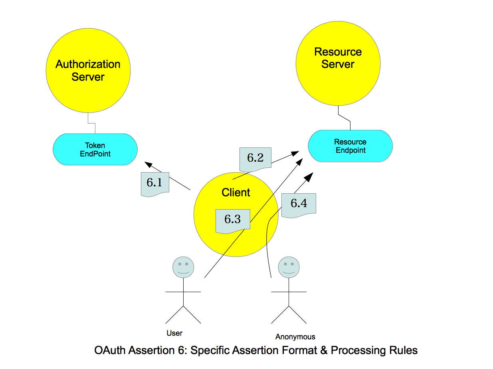

========================================
Assertion Framework for OAuth 2.0
========================================

.. contents:: Table of Contents
    :local:
   
http://tools.ietf.org/html/draft-ietf-oauth-assertions-09

.. _oauth_assertion.abstract:

.. include:: oauth_assertion/abstract.rst

.. _oauth_assertion.1:

.. include:: oauth_assertion/1.rst

.. _oauth_assertion.2:

.. include:: oauth_assertion/2.rst

.. _oauth_assertion.3:

.. include:: oauth_assertion/3.rst

.. _oauth_assertion.4:

.. include:: oauth_assertion/4.rst

Transportations:

    - :ref:`oauth_assertion.4.1`
    - :ref:`oauth_assertion.4.2`

.. _oauth_assertion.4.1:

.. include:: oauth_assertion/4.1.rst

.. _oauth_assertion.4.2:

.. include:: oauth_assertion/4.2.rst

.. _oauth_assertion.5:

.. include:: oauth_assertion/5.rst

Formats:

    - :ref:`oauth_assertion.5.1`
    - :ref:`oauth_assertion.5.2`

.. _oauth_assertion.5.1:

.. include:: oauth_assertion/5.1.rst

.. _oauth_assertion.5.2:

.. include:: oauth_assertion/5.2.rst

.. _oauth_assertion.6:

.. include:: oauth_assertion/6.rst

Format and Rules:

    - :ref:`oauth_assertion.6.1`
    - :ref:`oauth_assertion.6.2`
    - :ref:`oauth_assertion.6.3`
    - :ref:`oauth_assertion.6.4`

.. _oauth_assertion.6.1:

.. include:: oauth_assertion/6.1.rst

.. _oauth_assertion.6.2:

.. include:: oauth_assertion/6.2.rst

.. _oauth_assertion.6.3:

.. include:: oauth_assertion/6.3.rst

.. _oauth_assertion.6.4:

.. include:: oauth_assertion/6.4.rst

.. _oauth_assertion.7:

.. include:: oauth_assertion/7.rst

.. _oauth_assertion.8:

.. include:: oauth_assertion/8.rst

.. _oauth_assertion.9:

.. include:: oauth_assertion/9.rst

   
.. _oauth_assertion.9.1:

.. include:: oauth_assertion/9.1.rst

   
.. _oauth_assertion.9.2:

.. include:: oauth_assertion/9.2.rst

.. _oauth_assertion.9.3:

.. include:: oauth_assertion/9.3.rst

.. _oauth_assertion.10:

.. include:: oauth_assertion/10.rst

.. _oauth_assertion.11:

.. include:: oauth_assertion/11.rst
