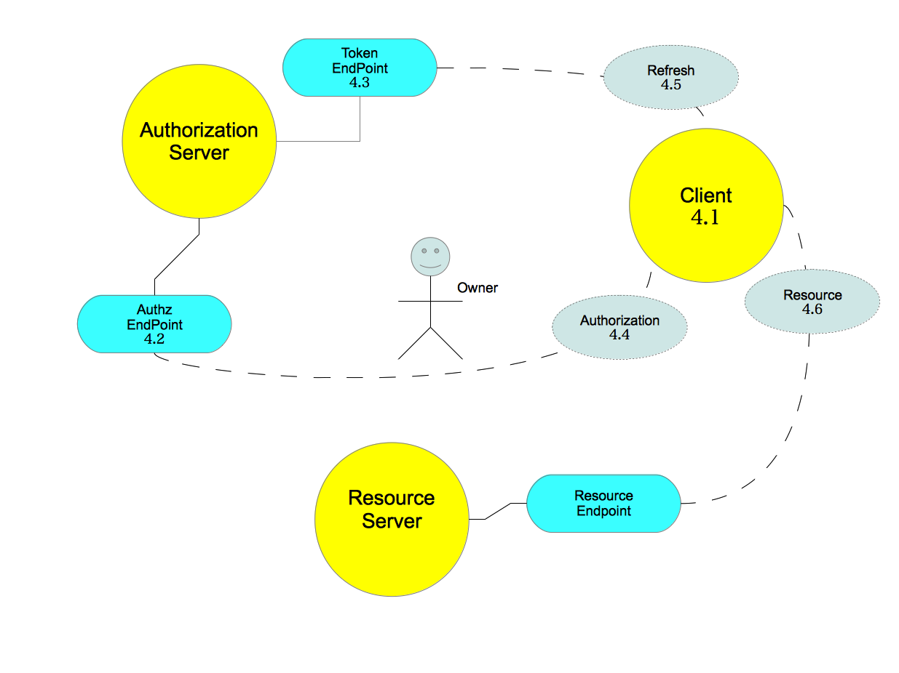
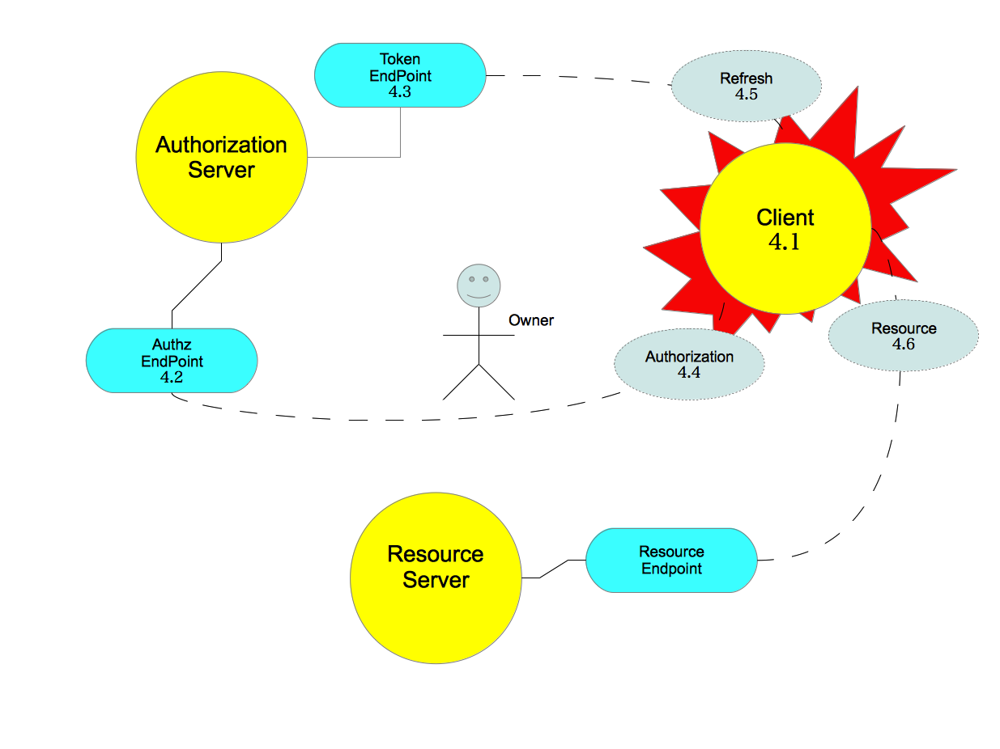
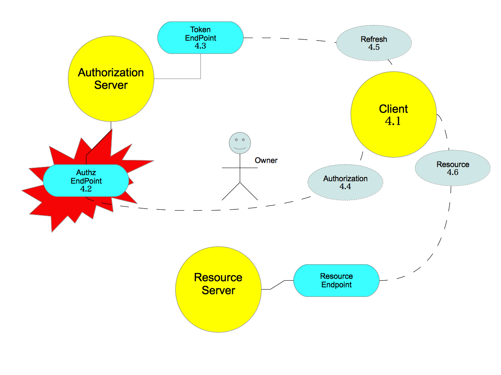
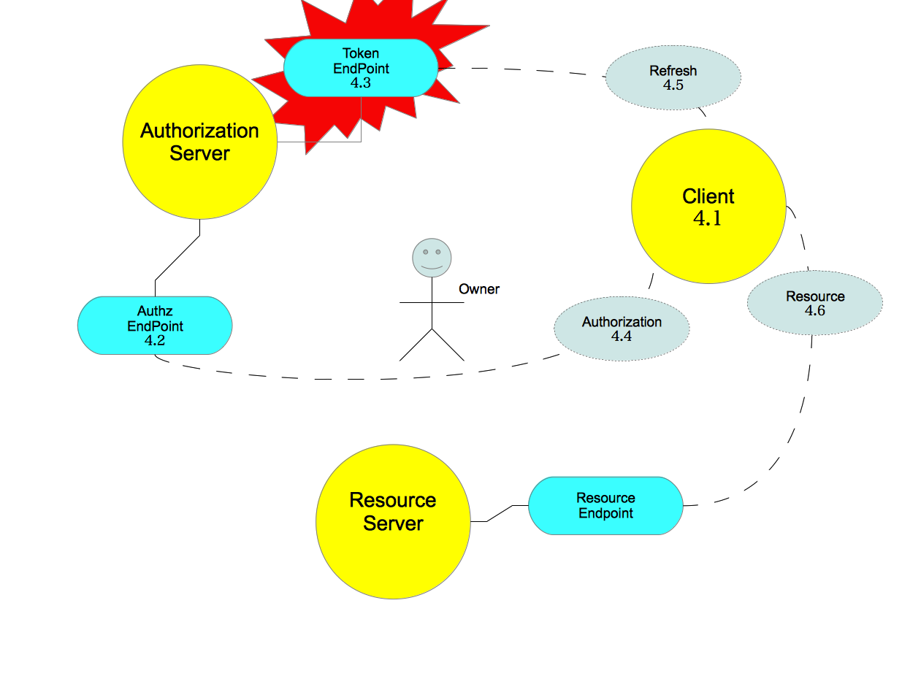
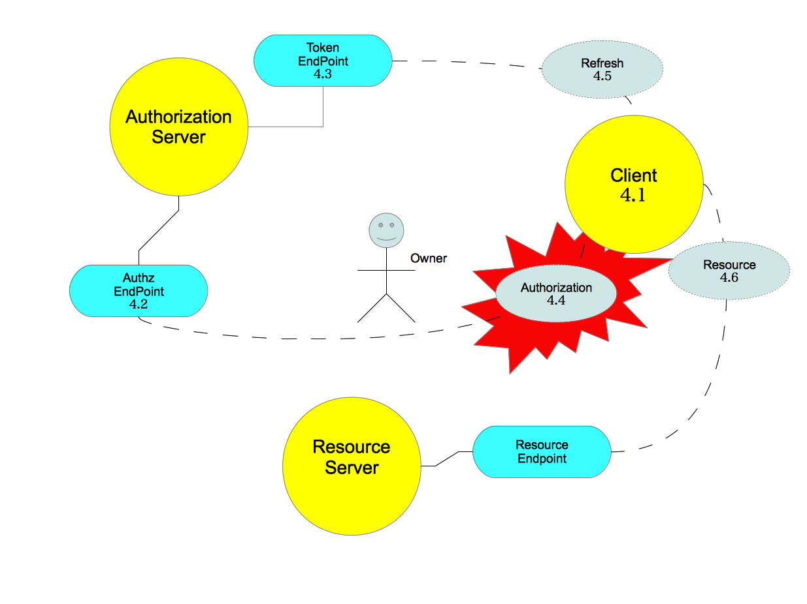
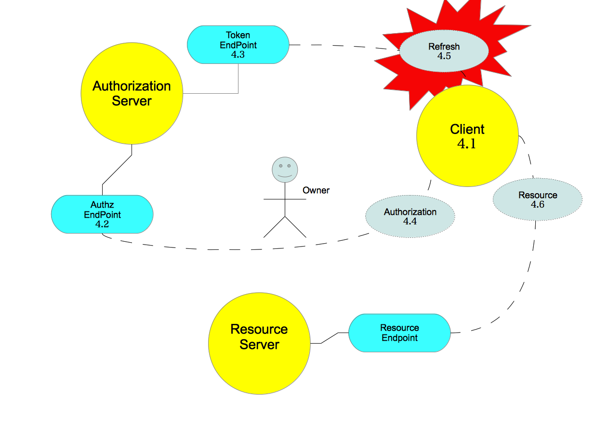
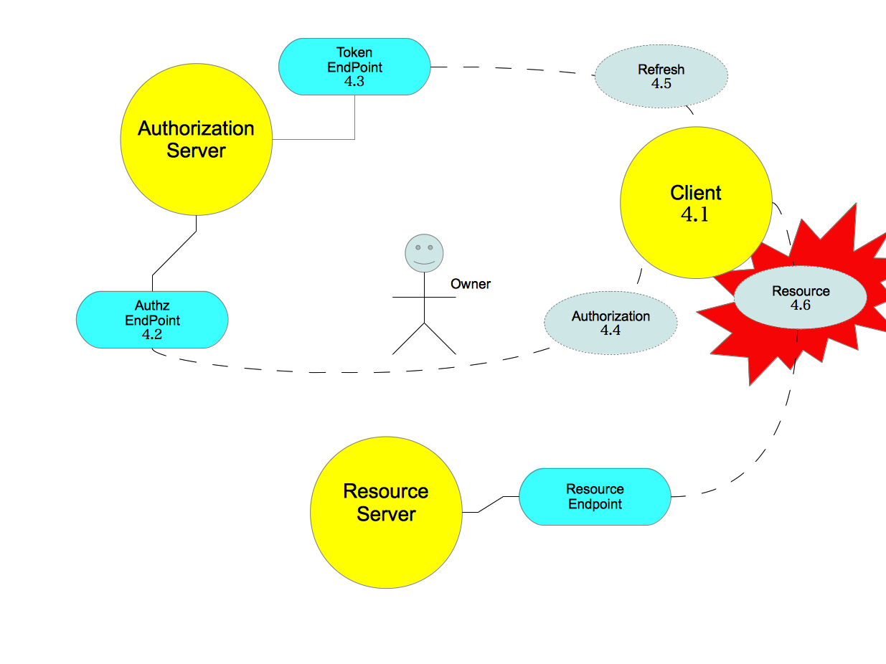
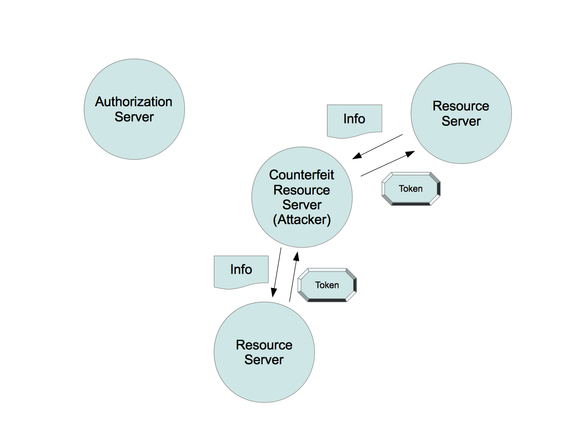
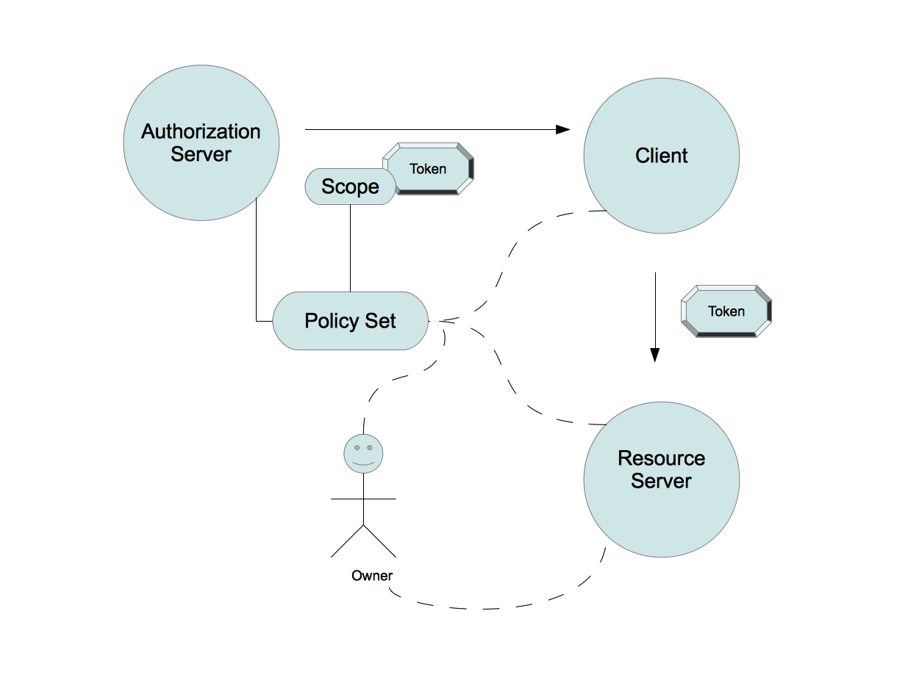
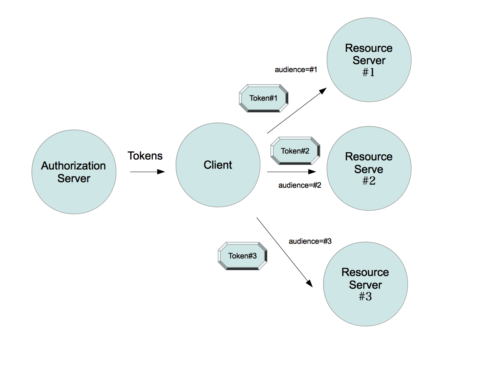

======================================================
Auth 2.0 Threat Model and Security Considerations
======================================================

- :rfc:`6819` ( http://tools.ietf.org/html/rfc6819 )
 
.. contents:: Table of Contents

.. _ouath_threat.abstract:

Abstract
============

This document gives :ref:`security considerations <auth_threat.5>` 
based on a comprehensive threat model for the :doc:`OAuth 2.0 Protocol <oauth>`.

.. _oauth_threat.1:

.. include:: oauth_threat/1.rst

2.  Overview
=====================

.. _oauth_threat.2.1:

.. include:: oauth_threat/2.1.rst

.. _oauth_threat.2.2:

.. include:: oauth_threat/2.2.rst

.. _oauth_threat.2.3:

.. include:: oauth_threat/2.3.rst

Compoents:

    - :ref:`oauth_threat.2.3.1`
    - :ref:`oauth_threat.2.3.2`
    - :ref:`oauth_threat.2.3.3`

.. _oauth_threat.2.3.1:

.. include:: oauth_threat/2.3.1.rst

.. _oauth_threat.2.3.2:

.. include:: oauth_threat/2.3.2.rst

.. _oauth_threat.2.3.3:

.. include:: oauth_threat/2.3.3.rst

.. _oauth_threat.3:

.. include:: oauth_threat/3.rst

Features:

    - :ref:`oauth_threat.3.1`
    - :ref:`oauth_threat.3.2`
    - :ref:`oauth_threat.3.3`
    - :ref:`oauth_threat.3.4`
    - :ref:`oauth_threat.3.5`
    - :ref:`oauth_threat.3.6`
    - :ref:`oauth_threat.3.7`

.. _oauth_threat.3.1:

.. include:: oauth_threat/3.1.rst

.. _oauth_threat.3.1.1:

.. include:: oauth_threat/3.1.1.rst

.. _oauth_threat.3.1.2:

.. include:: oauth_threat/3.1.2.rst

.. _oauth_threat.3.2:

.. include:: oauth_threat/3.2.rst

.. _oauth_threat.3.3:

.. include:: oauth_threat/3.3.rst

.. _oauth_threat.3.4:

.. include:: oauth_threat/3.4.rst

.. _oauth_threat.3.5:

.. include:: oauth_threat/3.5.rst

.. _oauth_threat.3.6:

.. include:: oauth_threat/3.6.rst

.. _oauth_threat.3.7:

.. include:: oauth_threat/3.7.rst

.. _oauth_threat.4:

.. include:: oauth_threat/4.rst

.. _oauth_threat.4.1:

.. include:: oauth_threat/4.1.rst

Threats:

    - :ref:`oauth_threat.4.1.1`
    - :ref:`oauth_threat.4.1.2`
    - :ref:`oauth_threat.4.1.3`
    - :ref:`oauth_threat.4.1.4`
    - :ref:`oauth_threat.4.1.5`

.. _oauth_threat.4.1.1:

.. include:: oauth_threat/4.1.1.rst

.. _oauth_threat.4.1.2:

.. include:: oauth_threat/4.1.2.rst

.. _oauth_threat.4.1.3:

.. include:: oauth_threat/4.1.3.rst

.. _oauth_threat.4.1.4:

.. include:: oauth_threat/4.1.4.rst

.. _oauth_threat.4.1.5:

.. include:: oauth_threat/4.1.5.rst

.. _oauth_threat.4.2:

.. include:: oauth_threat/4.2.rst

Threats:

    - :ref:`oauth_threat.4.2.1`
    - :ref:`oauth_threat.4.2.2`
    - :ref:`oauth_threat.4.2.3`
    - :ref:`oauth_threat.4.2.4`

.. _oauth_threat.4.2.1:

.. include:: oauth_threat/4.2.1.rst

.. _oauth_threat.4.2.2:

.. include:: oauth_threat/4.2.2.rst
   
.. _oauth_threat.4.2.3:

.. include:: oauth_threat/4.2.3.rst

.. _oauth_threat.4.2.4:

.. include:: oauth_threat/4.2.4.rst

.. _oauth_threat.4.3:

.. include:: oauth_threat/4.3.rst

Threats:

    - :ref:`oauth_threat.4.3.1`
    - :ref:`oauth_threat.4.3.2`
    - :ref:`oauth_threat.4.3.3`
    - :ref:`oauth_threat.4.3.4`
    - :ref:`oauth_threat.4.3.5`
    - :ref:`oauth_threat.4.3.6`

.. _oauth_threat.4.3.1:

.. include:: oauth_threat/4.3.1.rst

.. _oauth_threat.4.3.2:

.. include:: oauth_threat/4.3.2.rst

.. _oauth_threat.4.3.3:

.. include:: oauth_threat/4.3.3.rst

.. _oauth_threat.4.3.4:

.. include:: oauth_threat/4.3.4.rst

.. _oauth_threat.4.3.5:

.. include:: oauth_threat/4.3.5.rst

.. _oauth_threat.4.3.6:

.. include:: oauth_threat/4.3.6.rst

.. _oauth_threat.4.4:

.. include:: oauth_threat/4.4.rst

Flows:

    - :ref:`oauth_threat.4.4.1`
    - :ref:`oauth_threat.4.4.2`
    - :ref:`oauth_threat.4.4.3`

.. _oauth_threat.4.4.1:

.. include:: oauth_threat/4.4.1.rst

Threat list:

    - :ref:`oauth_threat.4.4.1.1`
    - :ref:`oauth_threat.4.4.1.2`
    - :ref:`oauth_threat.4.4.1.3`
    - :ref:`oauth_threat.4.4.1.4`
    - :ref:`oauth_threat.4.4.1.5`
    - :ref:`oauth_threat.4.4.1.6`
    - :ref:`oauth_threat.4.4.1.7`
    - :ref:`oauth_threat.4.4.1.8`
    - :ref:`oauth_threat.4.4.1.9`
    - :ref:`oauth_threat.4.4.1.10`
    - :ref:`oauth_threat.4.4.1.11`
    - :ref:`oauth_threat.4.4.1.12`

.. _oauth_threat.4.4.1.1:

.. include:: oauth_threat/4.4.1.1.rst

.. _oauth_threat.4.4.1.2:

.. include:: oauth_threat/4.4.1.2.rst

.. _oauth_threat.4.4.1.3:

.. include:: oauth_threat/4.4.1.3.rst

.. _oauth_threat.4.4.1.4:

.. include:: oauth_threat/4.4.1.4.rst

.. _oauth_threat.4.4.1.5:

.. include:: oauth_threat/4.4.1.5.rst

.. _oauth_threat.4.4.1.6:

.. include:: oauth_threat/4.4.1.6.rst

.. _oauth_threat.4.4.1.7:

.. include:: oauth_threat/4.4.1.7.rst

.. _oauth_threat.4.4.1.8:

.. include:: oauth_threat/4.4.1.8.rst

.. _oauth_threat.4.4.1.9:

.. include:: oauth_threat/4.4.1.9.rst

.. _oauth_threat.4.4.1.10:

.. include:: oauth_threat/4.4.1.10.rst

.. _oauth_threat.4.4.1.11:

.. include:: oauth_threat/4.4.1.11.rst

.. _oauth_threat.4.4.1.12:

.. include:: oauth_threat/4.4.1.12.rst

.. _oauth_threat.4.4.2:

.. include:: oauth_threat/4.4.2.rst

Threat list:

    - :ref:`oauth_threat.4.4.2.1`
    - :ref:`oauth_threat.4.4.2.2`
    - :ref:`oauth_threat.4.4.2.3`
    - :ref:`oauth_threat.4.4.2.4`
    - :ref:`oauth_threat.4.4.2.5`

.. _oauth_threat.4.4.2.1:

.. include:: oauth_threat/4.4.2.1.rst

.. _oauth_threat.4.4.2.2:

.. include:: oauth_threat/4.4.2.2.rst

.. _oauth_threat.4.4.2.3:

.. include:: oauth_threat/4.4.2.3.rst

.. _oauth_threat.4.4.2.4:

.. include:: oauth_threat/4.4.2.4.rst

.. _oauth_threat.4.4.2.5:

.. include:: oauth_threat/4.4.2.5.rst

.. _oauth_threat.4.4.3:

.. include:: oauth_threat/4.4.3.rst

Threat list:

    - :ref:`oauth_threat.4.4.3.1`
    - :ref:`oauth_threat.4.4.3.2`
    - :ref:`oauth_threat.4.4.3.3`
    - :ref:`oauth_threat.4.4.3.4`
    - :ref:`oauth_threat.4.4.3.5`
    - :ref:`oauth_threat.4.4.3.6`

.. _oauth_threat.4.4.3.1:

.. include:: oauth_threat/4.4.3.1.rst

.. _oauth_threat.4.4.3.2:

.. include:: oauth_threat/4.4.3.2.rst

.. _oauth_threat.4.4.3.3:

.. include:: oauth_threat/4.4.3.3.rst

.. _oauth_threat.4.4.3.4:

.. include:: oauth_threat/4.4.3.4.rst

.. _oauth_threat.4.4.3.5:

.. include:: oauth_threat/4.4.3.5.rst

.. _oauth_threat.4.4.3.6:

.. include:: oauth_threat/4.4.3.6.rst

.. _oauth_threat.4.5:

.. include:: oauth_threat/4.5.rst

Threat list:

    - :ref:`oauth_threat.4.5.1`
    - :ref:`oauth_threat.4.5.2`
    - :ref:`oauth_threat.4.5.3`
    - :ref:`oauth_threat.4.5.4`

.. _oauth_threat.4.5.1:

.. include:: oauth_threat/4.5.1.rst

.. _oauth_threat.4.5.2:

.. include:: oauth_threat/4.5.2.rst

.. _oauth_threat.4.5.3:

.. include:: oauth_threat/4.5.3.rst

.. _oauth_threat.4.5.4:

.. include:: oauth_threat/4.5.4.rst

.. _oauth_threat.4.6:

.. include:: oauth_threat/4.6.rst

Threat list:

    - :ref:`oauth_threat.4.6.1`
    - :ref:`oauth_threat.4.6.2`
    - :ref:`oauth_threat.4.6.3`
    - :ref:`oauth_threat.4.6.4`
    - :ref:`oauth_threat.4.6.5`
    - :ref:`oauth_threat.4.6.6`
    - :ref:`oauth_threat.4.6.7`

.. _oauth_threat.4.6.1:

.. include:: oauth_threat/4.6.1.rst

.. _oauth_threat.4.6.2:

.. include:: oauth_threat/4.6.2.rst

.. _oauth_threat.4.6.3:

.. include:: oauth_threat/4.6.3.rst

.. _oauth_threat.4.6.4:

.. include:: oauth_threat/4.6.4.rst

.. note::
    Refrered by a `discussion on a ML thread by initiated by Nat 
    <http://lists.openid.net/pipermail/openid-specs-ab/Week-of-Mon-20111107/001266.html>`_ 

.. _oauth_threat.4.6.5:

.. include:: oauth_threat/4.6.5.rst

.. _oauth_threat.4.6.6:

.. include:: oauth_threat/4.6.6.rst

.. _oauth_threat.4.6.7:

.. include:: oauth_threat/4.6.7.rst

.. _oauth_threat.5:

.. include:: oauth_threat/5.rst

.. _oauth_threat.5.1:

.. include:: oauth_threat/5.1.rst

.. _oauth_threat.5.1.1:

.. include:: oauth_threat/5.1.1.rst

.. _oauth_threat.5.1.2:

.. include:: oauth_threat/5.1.2.rst

.. _oauth_threat.5.1.3:

.. include:: oauth_threat/5.1.3.rst

.. _oauth_threat.5.1.4:

.. include:: oauth_threat/5.1.4.rst

Protections:

    - :ref:`oauth_threat.5.1.4.1`
    - :ref:`oauth_threat.5.1.4.2`

.. _oauth_threat.5.1.4.1:

.. include:: oauth_threat/5.1.4.1.rst

Measures:

    - :ref:`oauth_threat.5.1.4.1.1`
    - :ref:`oauth_threat.5.1.4.1.2`
    - :ref:`oauth_threat.5.1.4.1.3`
    - :ref:`oauth_threat.5.1.4.1.4`
    - :ref:`oauth_threat.5.1.4.1.5`
    

.. _oauth_threat.5.1.4.1.1:

.. include:: oauth_threat/5.1.4.1.1.rst

.. _oauth_threat.5.1.4.1.2:

.. include:: oauth_threat/5.1.4.1.2.rst

.. _oauth_threat.5.1.4.1.3:

.. include:: oauth_threat/5.1.4.1.3.rst

.. _oauth_threat.5.1.4.1.4:

.. include:: oauth_threat/5.1.4.1.4.rst

.. _oauth_threat.5.1.4.1.5:

.. include:: oauth_threat/5.1.4.1.5.rst

.. _oauth_threat.5.1.4.2:

.. include:: oauth_threat/5.1.4.2.rst

Measures:

    - :ref:`oauth_threat.5.1.4.2.1`
    - :ref:`oauth_threat.5.1.4.2.2`
    - :ref:`oauth_threat.5.1.4.2.3`
    - :ref:`oauth_threat.5.1.4.2.4`
    - :ref:`oauth_threat.5.1.4.2.5`

.. _oauth_threat.5.1.4.2.1:

.. include:: oauth_threat/5.1.4.2.1.rst

.. _oauth_threat.5.1.4.2.2:

.. include:: oauth_threat/5.1.4.2.2.rst

.. _oauth_threat.5.1.4.2.3:

.. include:: oauth_threat/5.1.4.2.3.rst

.. _oauth_threat.5.1.4.2.4:

.. include:: oauth_threat/5.1.4.2.4.rst

.. _oauth_threat.5.1.4.2.5:

.. include:: oauth_threat/5.1.4.2.5.rst

.. _oauth_threat.5.1.5:

.. include:: oauth_threat/5.1.5.rst

Measures:

    - :ref:`oauth_threat.5.1.5.1` 
    - :ref:`oauth_threat.5.1.5.2` 
    - :ref:`oauth_threat.5.1.5.3` 
    - :ref:`oauth_threat.5.1.5.4` 
    - :ref:`oauth_threat.5.1.5.5` 
    - :ref:`oauth_threat.5.1.5.6` 
    - :ref:`oauth_threat.5.1.5.7` 
    - :ref:`oauth_threat.5.1.5.8` 
    - :ref:`oauth_threat.5.1.5.9` 
    - :ref:`oauth_threat.5.1.5.10` 
    - :ref:`oauth_threat.5.1.5.11` 
    - :ref:`oauth_threat.5.1.5.12` 

.. _oauth_threat.5.1.5.1:

.. include:: oauth_threat/5.1.5.1.rst

.. _oauth_threat.5.1.5.2:

.. include:: oauth_threat/5.1.5.2.rst

.. _oauth_threat.5.1.5.3:

.. include:: oauth_threat/5.1.5.3.rst

.. _oauth_threat.5.1.5.4:

.. include:: oauth_threat/5.1.5.4.rst

.. _oauth_threat.5.1.5.5:

.. include:: oauth_threat/5.1.5.5.rst

.. _oauth_threat.5.1.5.6:

.. include:: oauth_threat/5.1.5.6.rst

.. _oauth_threat.5.1.5.7:

.. include:: oauth_threat/5.1.5.7.rst

.. _oauth_threat.5.1.5.8:

.. include:: oauth_threat/5.1.5.8.rst

.. _oauth_threat.5.1.5.9:

.. include:: oauth_threat/5.1.5.9.rst

.. _oauth_threat.5.1.5.10:

.. include:: oauth_threat/5.1.5.10.rst

.. _oauth_threat.5.1.5.11:

.. include:: oauth_threat/5.1.5.11.rst

.. _oauth_threat.5.1.5.12:

.. include:: oauth_threat/5.1.5.12.rst

.. _oauth_threat.5.1.6:

.. include:: oauth_threat/5.1.6.rst

.. _oauth_threat.5.2:

.. include:: oauth_threat/5.2.rst

Endpoints:
    
    - :ref:`oauth_threat.5.2.1`
    - :ref:`oauth_threat.5.2.2`
    - :ref:`oauth_threat.5.2.3`
    - :ref:`oauth_threat.5.2.4`

.. _oauth_threat.5.2.1:

.. include:: oauth_threat/5.2.1.rst

.. _oauth_threat.5.2.1.1:

.. include:: oauth_threat/5.2.1.1.rst

.. _oauth_threat.5.2.2:

.. include:: oauth_threat/5.2.2.rst

Measures:

    - :ref:`oauth_threat.5.2.2.1`
    - :ref:`oauth_threat.5.2.2.2`
    - :ref:`oauth_threat.5.2.2.3`
    - :ref:`oauth_threat.5.2.2.4`
    - :ref:`oauth_threat.5.2.2.5`
    - :ref:`oauth_threat.5.2.2.6`

.. _oauth_threat.5.2.2.1:

.. include:: oauth_threat/5.2.2.1.rst

.. _oauth_threat.5.2.2.2:

.. include:: oauth_threat/5.2.2.2.rst

.. _oauth_threat.5.2.2.3:

.. include:: oauth_threat/5.2.2.3.rst

.. _oauth_threat.5.2.2.4:

.. include:: oauth_threat/5.2.2.4.rst

.. _oauth_threat.5.2.2.5:

.. include:: oauth_threat/5.2.2.5.rst

.. _oauth_threat.5.2.2.6:

.. include:: oauth_threat/5.2.2.6.rst

.. _oauth_threat.5.2.3:

.. include:: oauth_threat/5.2.3.rst

Measures:

    - :ref:`oauth_threat.5.2.3.1`
    - :ref:`oauth_threat.5.2.3.2`
    - :ref:`oauth_threat.5.2.3.3`
    - :ref:`oauth_threat.5.2.3.4`
    - :ref:`oauth_threat.5.2.3.5`
    - :ref:`oauth_threat.5.2.3.6`
    - :ref:`oauth_threat.5.2.3.7`

.. _oauth_threat.5.2.3.1:

.. include:: oauth_threat/5.2.3.1.rst

.. _oauth_threat.5.2.3.2:

.. include:: oauth_threat/5.2.3.2.rst

.. _oauth_threat.5.2.3.3:

.. include:: oauth_threat/5.2.3.3.rst

.. _oauth_threat.5.2.3.4:

.. include:: oauth_threat/5.2.3.4.rst

.. _oauth_threat.5.2.3.5:

.. include:: oauth_threat/5.2.3.5.rst

.. _oauth_threat.5.2.3.6:

.. include:: oauth_threat/5.2.3.6.rst

.. _oauth_threat.5.2.3.7:

.. include:: oauth_threat/5.2.3.7.rst

.. _oauth_threat.5.2.4:

.. include:: oauth_threat/5.2.4.rst

Measures:

    - :ref:`oauth_threat.5.2.4.1`
    - :ref:`oauth_threat.5.2.4.2`
    - :ref:`oauth_threat.5.2.4.3`
    - :ref:`oauth_threat.5.2.4.4`
    - :ref:`oauth_threat.5.2.4.5`

.. _oauth_threat.5.2.4.1:

.. include:: oauth_threat/5.2.4.1.rst

.. _oauth_threat.5.2.4.2:

.. include:: oauth_threat/5.2.4.2.rst

.. _oauth_threat.5.2.4.3:

.. include:: oauth_threat/5.2.4.3.rst

.. _oauth_threat.5.2.4.4:

.. include:: oauth_threat/5.2.4.4.rst

.. _oauth_threat.5.2.4.5:

.. include:: oauth_threat/5.2.4.5.rst

.. _oauth_threat.5.3:

.. include:: oauth_threat/5.3.rst

Measures:

    - :ref:`oauth_threat.5.3.1`
    - :ref:`oauth_threat.5.3.2`
    - :ref:`oauth_threat.5.3.3`
    - :ref:`oauth_threat.5.3.4`
    - :ref:`oauth_threat.5.3.5`
    - :ref:`oauth_threat.5.3.6`
    
.. _oauth_threat.5.3.1:

.. include:: oauth_threat/5.3.1.rst

.. _oauth_threat.5.3.2:

.. include:: oauth_threat/5.3.2.rst

.. _oauth_threat.5.3.3:

.. include:: oauth_threat/5.3.3.rst

.. _oauth_threat.5.3.4:

.. include:: oauth_threat/5.3.4.rst

.. _oauth_threat.5.3.5:

.. include:: oauth_threat/5.3.5.rst

.. _oauth_threat.5.3.6:

.. include:: oauth_threat/5.3.6.rst

.. _oauth_threat.5.4:

.. include:: oauth_threat/5.4.rst

Considerations:

    - :ref:`oauth_threat.5.4.1`
    - :ref:`oauth_threat.5.4.2`
    - :ref:`oauth_threat.5.4.3`

.. _oauth_threat.5.4.1:

.. include:: oauth_threat/5.4.1.rst

.. _oauth_threat.5.4.2:

.. include:: oauth_threat/5.4.2.rst

.. _oauth_threat.5.4.3:

.. include:: oauth_threat/5.4.3.rst

.. _oauth_threat.6:

.. include:: oauth_threat/6.rst

.. _oauth_threat.7:

.. include:: oauth_threat/7.rst

.. _oauth_threat.8:

.. include:: oauth_threat/8.rst

.. _oauth_threat.8.1:

.. include:: oauth_threat/8.1.rst

.. _oauth_threat.8.2:

.. include:: oauth_threat/8.2.rst

