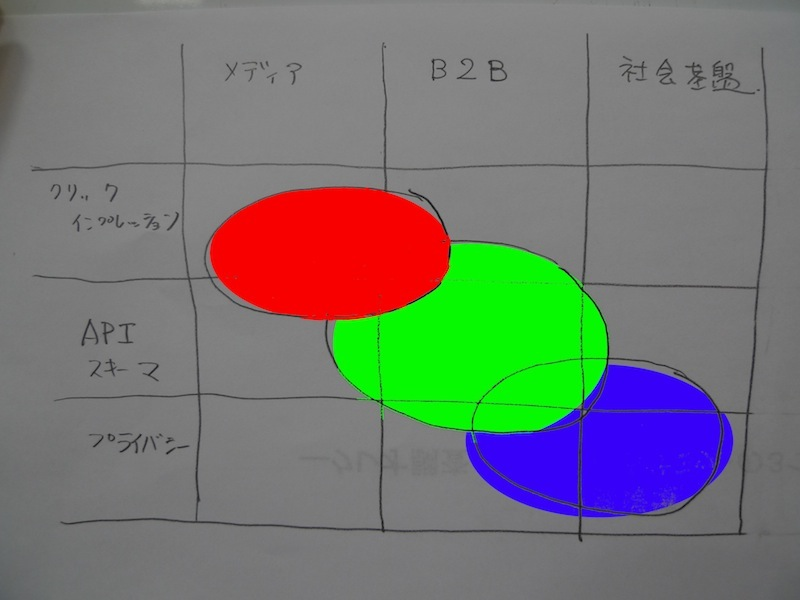

=========
TODO/TBD
=========

.. contents::
    :local:

My Issue
===========

OP Initiated Assertion
--------------------------------------------

- client_id ?  
- client_id の為に OP Initiated Registration?
    
    - OP gives an client credential to RP
    - OP ask RP to register itself vai :doc:`reg`

Token Forwarding
------------------

- Bearer Tokenをフォワードしていいか？
- Issuer, Audienceのペアリングが重要なのであれば、:doc:`uma_core` の :term:`Requester Permission Token` は？

Disconnected
----------------

- メディア企業、ビジネス、 社会基盤で興味の主眼が違う

- コンポーネント化

    - Authorization Workflow (OAuth2)
    - Identity Assertion / Session (ID Token)
    - Attributes  (UserInfo ....)
    - Request Extension ( Request Object )
    - Service ( API ,Schema , Tokens )
    - Discovery / Association  / Registration
    - Security (JWT, JOSE)
    - Policy and Access Controll ( Account Linking, Policy Expression, Proxy, Delegation ) 
    - Smart Application and Browser 

TODO
=====
.. todolist::
